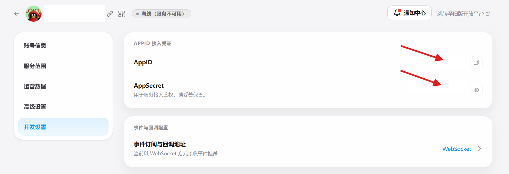

<h1 align="center">JM QQ Bot</h1>

<p align="center">
  <a href="https://github.com/ji333abc/jm-qqbot/tags"></a>
  <a href="https://github.com/ji333abc/jm-qqbot/actions/workflows/ci.yml"></a>
  
  
  <a href="LICENSE"></a>
  <a href="https://github.com/ji333abc/jm-qqbot/stargazers"></a>
  <a href="https://github.com/ji333abc/jm-qqbot/forks"></a>
</p>

使用 Docker 部署的 QQ 群 JM 下载机器人。

群成员发送 `@机器人 JM 作品ID` 后，机器人会下载作品图片、生成 PDF、创建带随机密码的 AES 加密 ZIP，并将文件上传到当前 QQ 群。

## 功能

- 支持单个和批量下载，可查询页数、预计时间与实时进度
- 图片按章节和页码排序，自动生成 PDF
- PDF 超限时降低质量，仍然超限或转换失败则打包原图
- 每个任务生成独立的 14 位随机解压密码
- 支持群和用户白名单，任务依次执行以控制资源占用
- 自动处理重复消息、超时、上传重试与临时文件清理
- 提供 Docker 健康检查和自动重启

## 运行要求

- QQ 官方机器人 App ID 和 App Secret
- 已为机器人开通群消息事件和群文件能力
- Docker Engine
- Docker Compose v2
- 最低配置：512 MB 内存、1 vCPU
- 推荐配置：1 GB 内存、1–2 vCPU、5 GB 可用临时磁盘空间
- 处理大型作品时建议使用 2 GB 或更多内存

> 256 MB 内存仅适合功能测试，处理大型作品时可能因内存不足而退出。

## Docker 部署

```bash
git clone https://github.com/ji333abc/jm-qqbot.git
cd jm-qqbot
cp .env.example .env
```

进入 [QQ 开放平台](https://q.qq.com/)的机器人管理页面，在“开发设置”中复制 AppID 和 AppSecret：



然后编辑 `.env`，填入复制的值：

```dotenv
QQBOT_APP_ID=你的AppID
QQBOT_APP_SECRET=你的AppSecret
```

启动机器人：

```bash
docker compose up -d --build
```

查看日志：

```bash
docker compose logs -f bot
```

查看容器状态：

```bash
docker compose ps
```

停止机器人：

```bash
docker compose down
```

更新版本：

```bash
git pull
docker compose up -d --build
```

## 使用命令

下载一个作品：

```text
@机器人 JM 123456
```

批量下载：

```text
@机器人 JM 123456 234567 345678
```

查看用法：

```text
@机器人 JM
```

查询当前任务的下载进度：

```text
@机器人 JM进度
```

同一条命令中的重复 ID 会自动去重。批量任务按照输入顺序逐个下载和上传。

## 权限配置

建议使用群白名单和用户白名单限制下载权限：

```dotenv
QQBOT_ALLOWED_GROUP_OPENIDS=群OpenID1,群OpenID2
QQBOT_JM_ALLOWED_USER_OPENIDS=用户OpenID1,用户OpenID2
```

- 群白名单为空：机器人所在的所有群都可以提交命令。
- 用户白名单为空：群内所有成员都可以提交下载任务。
- 两项同时配置：只有指定群中的指定成员可以提交任务。

## 完整配置

| 变量 | 默认值 | 说明 |
|---|---:|---|
| `QQBOT_APP_ID` | 无 | QQ 机器人 App ID，必填 |
| `QQBOT_APP_SECRET` | 无 | QQ 机器人 App Secret，必填 |
| `QQBOT_ALLOWED_GROUP_OPENIDS` | 空 | 允许使用机器人的群 OpenID，逗号分隔 |
| `QQBOT_JM_ALLOWED_USER_OPENIDS` | 空 | 允许下载的用户 OpenID，逗号分隔 |
| `QQBOT_JM_BATCH_MAX_ITEMS` | `3` | 单条命令最多包含的作品数 |
| `QQBOT_JM_MAX_BYTES` | `83886080` | ZIP 最大字节数，不能超过 100 MiB |
| `QQBOT_JM_TIMEOUT_SECONDS` | `1200` | 单个作品下载和打包超时秒数 |
| `QQBOT_JM_UPLOAD_TIMEOUT_SECONDS` | `900` | QQ 文件上传超时秒数 |
| `QQBOT_JM_INSPECT_TIMEOUT_SECONDS` | `30` | 作品页数查询超时秒数 |
| `QQBOT_JM_FAILURE_RETAIN_SECONDS` | `1800` | 上传失败任务的保留秒数 |
| `QQBOT_JM_TEMP_ROOT` | `/app/data/jm-tasks` | 任务临时目录 |
| `QQBOT_JM_TIMING_PATH` | `/app/data/jm-timing.json` | 耗时样本文件 |
| `LOG_LEVEL` | `INFO` | 日志级别 |

## 文件与数据

Docker Compose 将宿主机的 `./data` 挂载到容器的 `/app/data`。

- 下载图片、PDF 和 ZIP 保存在 `data/jm-tasks`。
- 上传成功后，当前任务目录立即删除。
- 上传失败且已经生成 ZIP 时，任务目录按配置延迟删除。
- `data/jm-timing.json` 保存最近的任务耗时样本，用于估算后续任务时长。
- App Secret 只从 `.env` 读取，不会写入任务文件。
- ZIP 解压密码只发送到发起任务的 QQ 群消息中。

## 本地开发

需要 Python 3.11+ 和 Node.js 18+：

```bash
python -m venv .venv
. .venv/bin/activate
pip install -e .
npm ci --prefix uploader
cp .env.example .env
jm-qqbot
```

Windows PowerShell 使用：

```powershell
.\.venv\Scripts\Activate.ps1
```

运行测试：

```bash
python -m unittest discover -s tests -v
npm test --prefix uploader
```

## 安全

- 不要提交 `.env`、App Secret、任务文件或运行日志。
- 对外开放机器人时应配置群白名单和用户白名单。
- 根据服务器磁盘、内存和网络带宽设置任务数量与文件大小限制。
- 只下载和分享你有权访问及传播的内容。

## License

[MIT](LICENSE)
